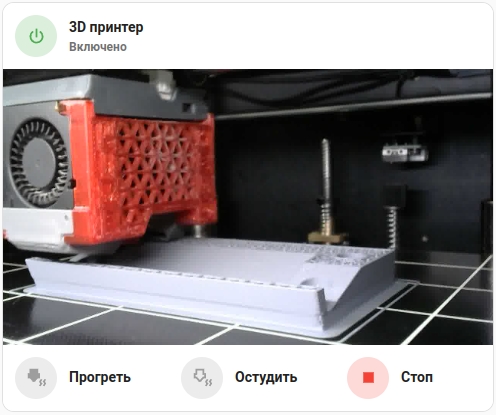
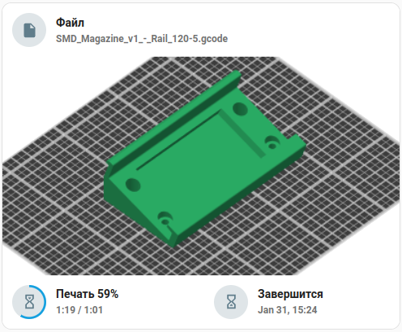

### 3D printer cards



<details><summary>Main card code</summary>

```yaml
type: custom:vertical-stack-in-card
horizontal: false
cards:
  - type: custom:mushroom-entity-card
    name: 3D принтер
    icon: mdi:power
    icon_color: green
    entity: switch.bear_power
    tap_action:
      action: toggle
    secondary_info: state
  - type: picture-entity
    entity: camera.printer
    camera_image: camera.printer
    hide_if_unavailable: true
    show_state: false
    show_name: false
    camera_view: live
  - type: grid
    square: false
    columns: 3
    cards:
      - type: custom:mushroom-template-card
        entity: sensor.bear_power_energy_total
        primary: Прогреть
        secondary: null
        tap_action:
          action: call-service
          service: mqtt.publish
          service_data:
            topic: octoprint/hassControl/commands
            payload: '["M104 S230"]'
        icon: mdi:printer-3d-nozzle-heat
        icon_color: |2-
                    
                    
                    grey
                    
                    orange
                    
      - type: custom:mushroom-template-card
        primary: Остудить
        secondary: null
        tap_action:
          action: call-service
          service: mqtt.publish
          service_data:
            topic: octoprint/hassControl/commands
            payload: '["M104 S0","M140 S0","M84"]'
        icon: mdi:printer-3d-nozzle-heat-outline
        icon_color: |2-
                    
                    
                    grey
                    
                    blue
                    
      - type: custom:mushroom-template-card
        entity: button.3d_printer_cancel_print
        primary: Стоп
        secondary: null
        tap_action:
          action: toggle
        icon: mdi:stop
        icon_color: |2-
                    
                    
                    grey
                    
                    red
                    
                    
```

</details>



<details><summary>Thumbnail card code</summary>

```yaml
type: custom:vertical-stack-in-card
cards:
  - type: custom:mushroom-template-card
    entity: sensor.3d_printer_print_file
    tap_action:
      action: more-info
    icon: mdi:file
    icon_color: |2-
                
                grey
                
                blue-grey
                
    primary: Файл
    secondary: |2-
               
               
               Не выбран
               
               {{ states(entity) }}
               
  - type: picture-entity
    entity: camera.3d_printer_gcode_thumbnail
    show_state: false
    show_name: false
    camera_view: auto
  - type: grid
    square: false
    columns: 2
    cards:
      - type: custom:mushroom-template-card
        entity: sensor.3d_printer_print_progress
        tap_action:
          action: more-info
        icon: mdi:timer-sand
        icon_color: |2-
                    
                    grey
                    
                    blue-grey
                    
        primary: |2-
                 
                 
                 
                 Подготовка
                 
                 Печать {{ states(entity) | float | round(0) }}%
                 
                 Ожидание
                 
                 Выключен
                 
        secondary: |2-
                   
                   
                   
                   {{ states("sensor.3d_printer_print_time")[0:-3] }} / 
                   {{ states("sensor.3d_printer_print_time_left")[0:-3] }} 
                   
        card_mod:
          style:
            mushroom-shape-icon$: |
              .shape {
                background: radial-gradient(var(--card-background-color) 60%, transparent calc(60% + 1px)), conic-gradient(rgb(var(--rgb-light-blue)) {{ (states(config.entity) |float) | round(0) }}% 0%, var(--card-background-color) 0% 100%);
              }
              .shape:after {
                content: "";
                height: 100%;
                width: 100%;
                position: absolute;
                border-radius: 50%;
                background: rgba(var(--rgb-blue-grey), 0.2);
              }
      - type: custom:mushroom-template-card
        entity: sensor.3d_printer_approximate_completion_time
        primary: Завершится
        secondary: |2-
                   
                   
                   Неизвестно
                   
                   {{ states(entity)[0:-3] }}
                   
        tap_action:
          action: more-info
        icon: mdi:timer-sand-complete
        icon_color: |2-
                    
                    grey
                    
                    blue-grey
                    
```
</details>

